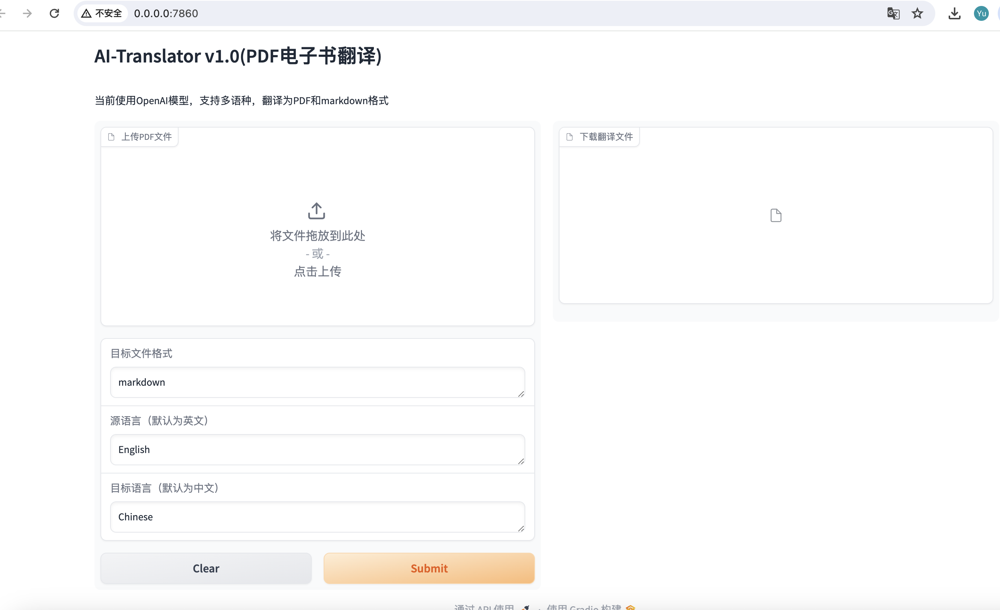
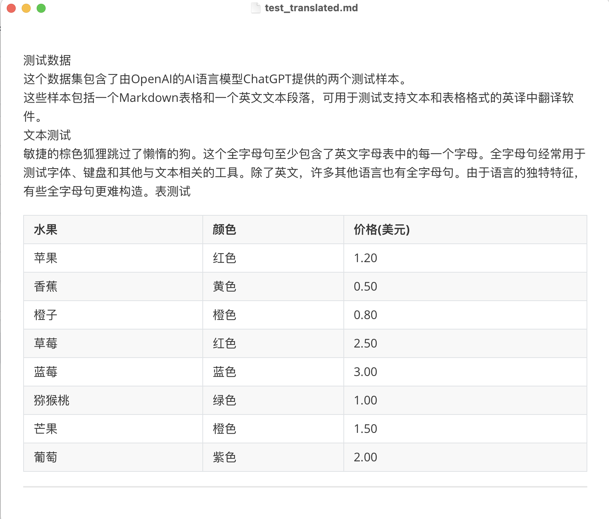
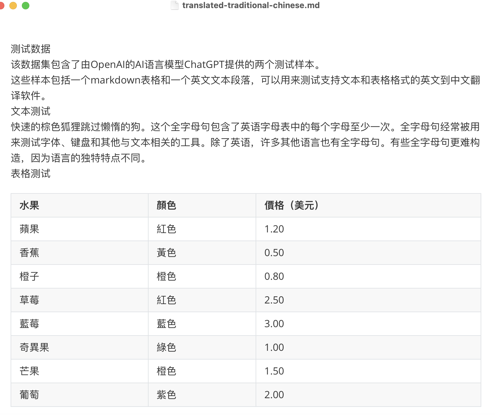
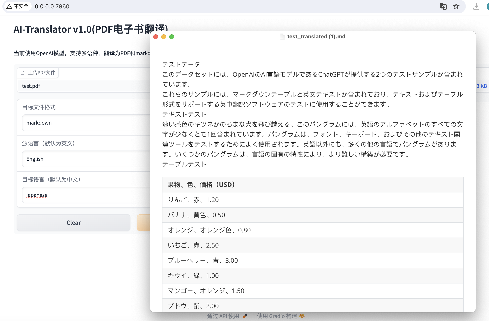
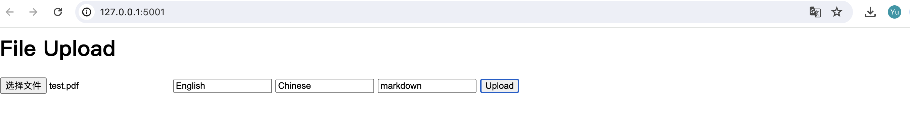

# 极客时间《AI大模型应用开发实战营》Project 1

## 支持Features清单

### 1. Gradio图形用户界面
启动命令： python ai_translator/gradio_frontend.py

在UI界面上使用 Gradio. 

一共有4个组件：1 个File和 3个textbox,
分别接收参数 pdf files, file format, source_language 和 target_language。

### 2. 添加对其他语言的支持

- 下面的截图记录了把 test.pdf 和 老人与海.pdf翻译成中文。

- 下面的截图记录了把 test.pdf 和 老人与海.pdf翻译成繁体中文。

- 下面的截图记录了把 test.pdf 和 老人与海.pdf翻译成日语。

### 3. 服务化：以API形式提供翻译服务支持。
启动命令： python ai_translator/flask_backend.py
采用flask提供简单的web接口。
http://127.0.0.1:5001/ 为简单的翻译功能测试界面，类似Gradio的4个控件，分别是文件，源语言，目标语言，目标文件格式；
点击Upload，系统调用后端API /translation的POST接口，执行成功后会自动下载翻译后的文件。

### 4. 保持原始文档布局和Table样式输出

还未实现。

### 5. Prompt例子

还未做个性化优化，只是添加了多语种参数。

text prompt:
”You are a translation expert, proficient in various languages. \n Translates {source_language} to {target_language}：\n{text}“

table prompt:
"You are a translation expert, proficient in various languages. \n Translates {source_language} to {target_language}，maintain in table form：\n{table}"
  

## 学习心得

1. 使用了 Gradio UI
2. 使用了 flask框架，调用openai rest api
3. 使用了 openai的prompt
4. 熟悉了chatgpt应用的组件划分和优化步骤
   
## 代码地址

[MyCodeRepo in Github](https://github.com/jacket628/openai-quickstart/tree/main/openai-translator)
